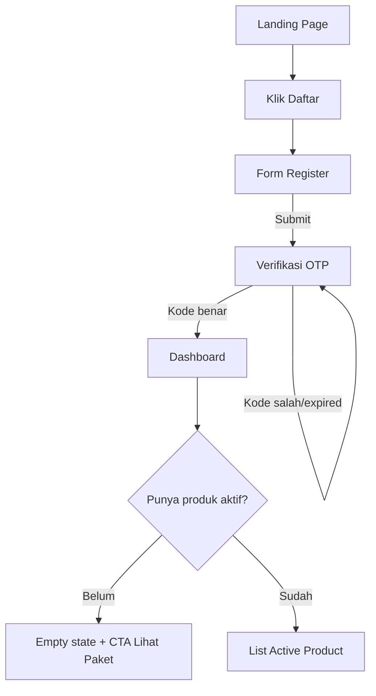
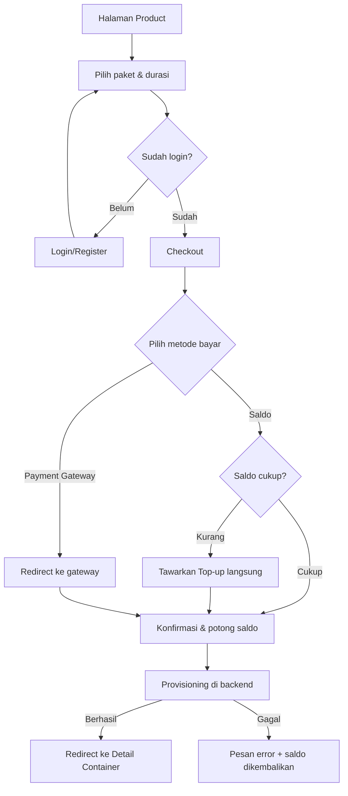
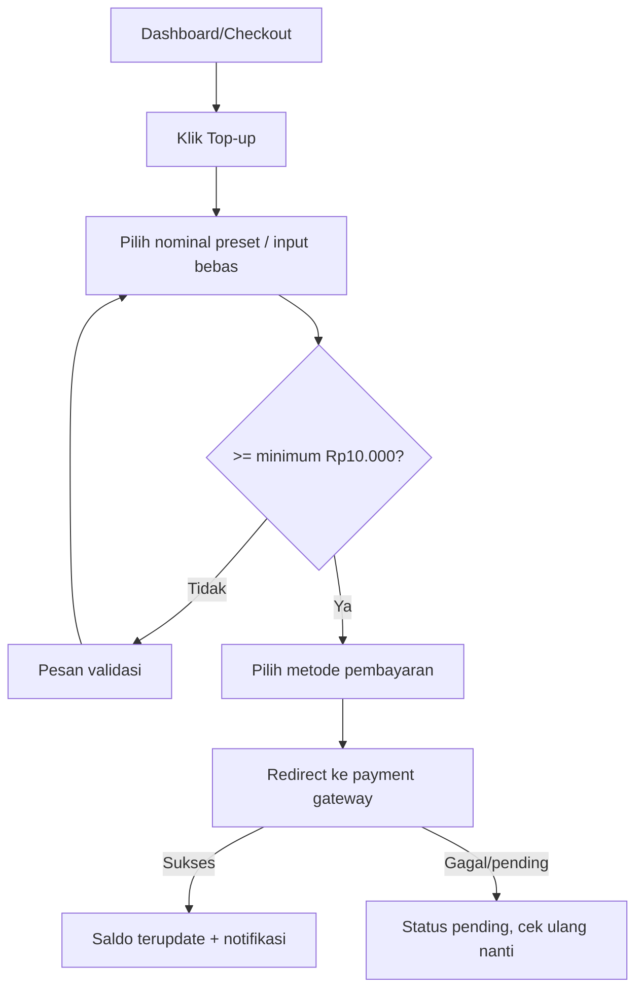
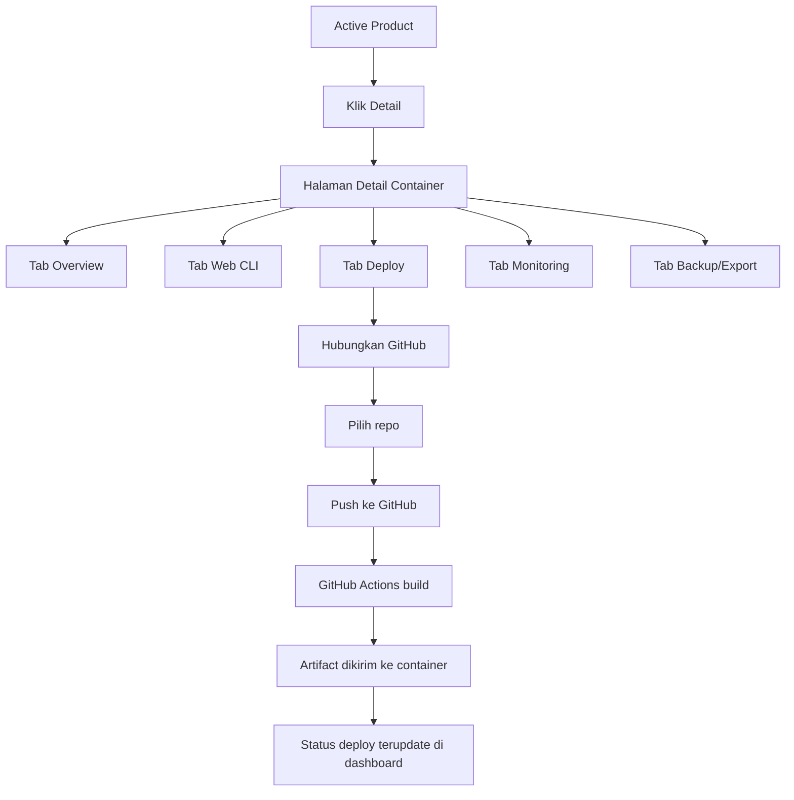
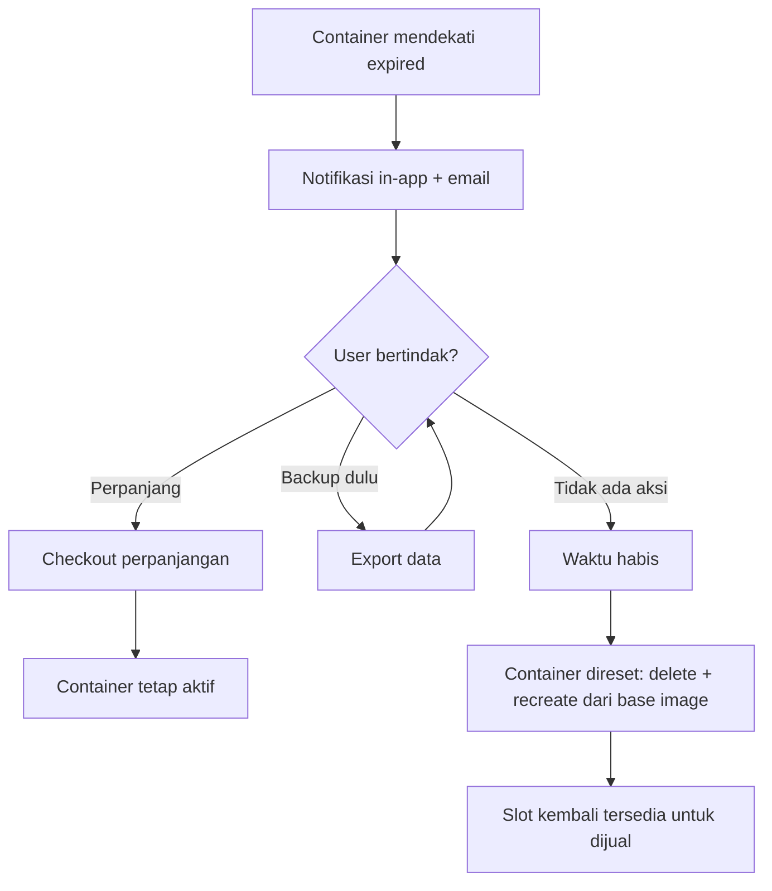
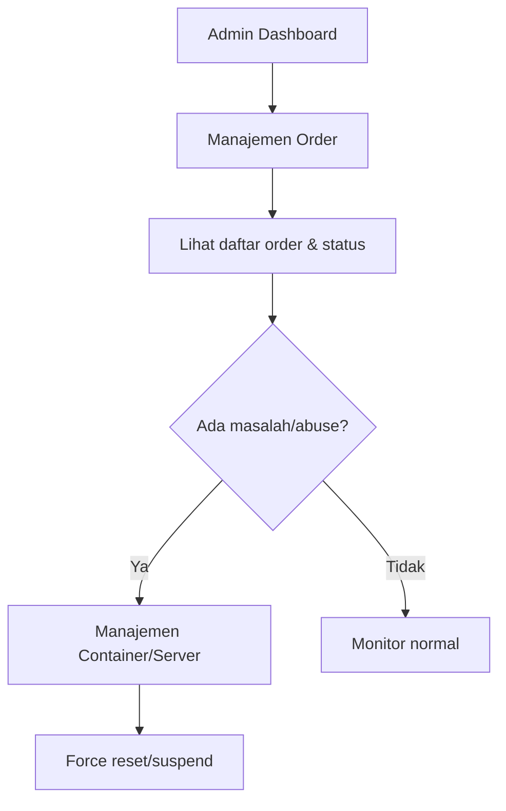

# User Flows — RuPa Cloud

## 1. Registrasi & Onboarding

## 2. Sewa Produk Baru (Checkout)

## 3. Top-up Saldo

## 4. Kelola Produk Aktif — Deploy & CLI

## 5. Perpanjangan & Expired

## 6. Alur Admin — Kelola Order

---

**Catatan:** diagram di atas pakai sintaks Mermaid — akan otomatis ter-render kalau file ini dibuka di GitHub, banyak editor Markdown modern, atau saat dipublikasikan sebagai halaman web. Kalau perlu versi visual langsung, aku bisa buatkan diagramnya sebagai gambar terpisah.
